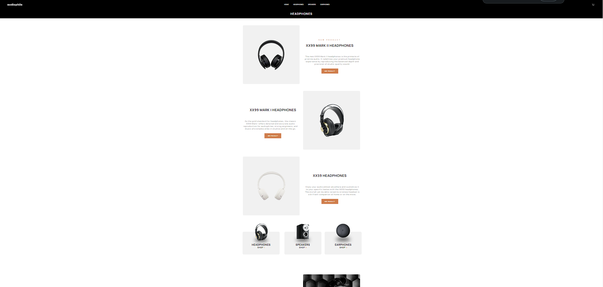

# Frontend Mentor - Audiophile e-commerce website solution

This is a solution to the [Audiophile e-commerce website challenge on Frontend Mentor](https://www.frontendmentor.io/challenges/audiophile-ecommerce-website-C8cuSd_wx). Frontend Mentor challenges help you improve your coding skills by building realistic projects. 

## Table of contents

- [Overview](#overview)
  - [The challenge](#the-challenge)
  - [Screenshot](#screenshot)
  - [Links](#links)
- [My process](#my-process)
  - [Built with](#built-with)
  - [What I learned](#what-i-learned)
  - [Continued development](#continued-development)
  - [Useful resources](#useful-resources)
- [Author](#author)
- [Acknowledgments](#acknowledgments)

**Note: Delete this note and update the table of contents based on what sections you keep.**

## Overview

### The challenge

Users should be able to:

- View the optimal layout for the app depending on their device's screen size
- See hover states for all interactive elements on the page
- Add/Remove products from the cart
- Edit product quantities in the cart
- Fill in all fields in the checkout
- Receive form validations if fields are missed or incorrect during checkout
- See correct checkout totals depending on the products in the cart
  - Shipping always adds $50 to the order
  - VAT is calculated as 20% of the product total, excluding shipping
- See an order confirmation modal after checking out with an order summary
- **Bonus**: Keep track of what's in the cart, even after refreshing the browser (`localStorage` could be used for this if you're not building out a full-stack app)

### Screenshot





### Links

- Solution URL: [https://github.com/ardaocakkk/audiophile](https://github.com/ardaocakkk/audiophile)
- Live Site URL: [https://audiophile-amber.vercel.app/](https://audiophile-amber.vercel.app/)

## My process

### Built with

- Flexbox
- CSS Grid
- Mobile-first workflow
- [React](https://reactjs.org/) - JS library
- [Next.js](https://nextjs.org/) - React framework
- [Tailwindcss](https://tailwindcss.com/) - For styles
- [Material-UI](https://material-ui.com/) - For styles
- [Redux](https://redux.js.org/) - For state management


### What I learned

Page and Template structure with Next.js

```
export default function ProductLayout({ children }) {

    return (
        <div>
            <div>{children}</div>
        </div>
    );
}

```
Redux Tool Kit for State Management

```
import { createSlice } from '@reduxjs/toolkit';

const cartSlice = createSlice({
    name: "cart",
    initialState,
    reducers: {
        addToCart : (state, action) => {
            const {product, quantity} = action.payload;

            const itemIndex = state.cartItems.findIndex((item) => item.id === product.id);
            if(itemIndex >= 0) {
                const tempProduct = state.cartItems[itemIndex];
                tempProduct.quantity += 1;
                state.cartItems[itemIndex] = tempProduct;
            }else {
                const tempProduct = cartItem.find((item) => item.id === product.id);

                if (tempProduct) {
                    const newProduct = {
                        ...tempProduct,
                        quantity: quantity,
                    };
                    state.cartItems.push(newProduct);
                } else {
                    console.error('Product not found!');
                }
            }
        },
        removeFromCart : (state, action) => {
            const id = action.payload;
            state.cartItems = state.cart.filter((item) => item.id !== id);
        },
        clearCart : (state) => {
            state.cartItems = [];
        },
        incrementItemQuantity : (state, action) => {
            const tempProduct = state.cartItems.find((item) => item.id === action.payload.id);
            tempProduct.quantity += 1;
        },
        decrementItemQuantity : (state, action) => {
            const tempProduct = state.cartItems.find((item) => item.id === action.payload.id);
            if(tempProduct.quantity >= 1) {
                tempProduct.quantity -= 1;
                if(tempProduct.quantity === 0) {
                    state.cartItems = state.cartItems.filter((item) => item.id !== action.payload.id);
                }
            }


        }
    }
});

export const {addToCart,removeFromCart, clearCart, incrementItemQuantity, decrementItemQuantity} = cartSlice.actions;
export default cartSlice.reducer;
```


## Author

- Frontend Mentor - [@ardaocakkk](https://www.frontendmentor.io/profile/ardaocakkk)


